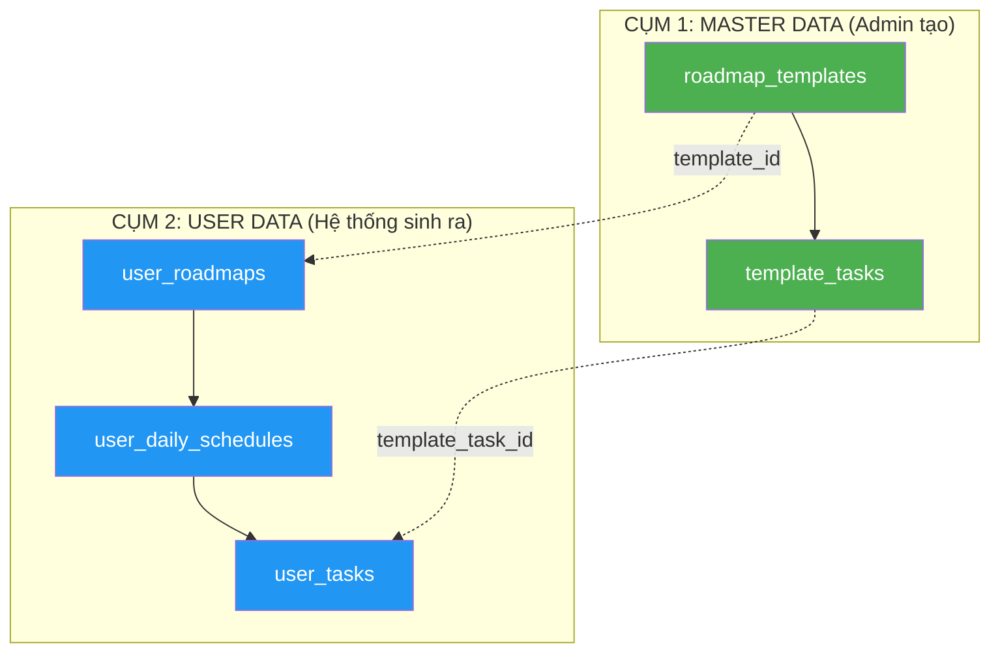
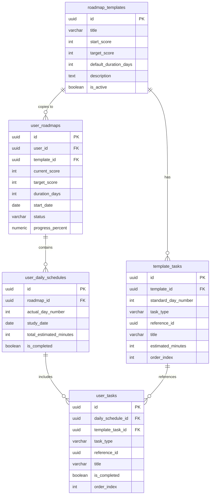

# 🗺️ Tính năng Lộ Trình Học Tập Cá Nhân Hóa (Learning Roadmap)

> Hệ thống tự động tạo lộ trình học TOEIC cá nhân hóa dựa trên trình độ hiện tại, điểm mục tiêu và thời gian cam kết của người dùng.

---

## 📋 Mục lục

- [Tổng quan](#-tổng-quan)
- [Luồng nghiệp vụ](#-luồng-nghiệp-vụ-chi-tiết)
- [Thiết kế Database](#️-thiết-kế-database)
- [Thuật toán tạo lộ trình](#-thuật-toán-tạo-lộ-trình)
- [Xử lý Edge Cases](#-xử-lý-edge-cases)
- [API Endpoints](#-api-endpoints)
- [TypeScript Types](#-typescript-types)
- [UI/UX Flow](#-uiux-flow)
- [Cấu trúc thư mục](#-cấu-trúc-thư-mục)

---

## 🌟 Tổng quan

### Vấn đề cần giải quyết
Người dùng hiện tại học TOEIC một cách tự do, không có kế hoạch cụ thể. Điều này dẫn đến:
- Không biết nên học gì mỗi ngày
- Không đo lường được tiến độ so với mục tiêu
- Dễ bỏ cuộc vì thiếu định hướng

### Giải pháp
Hệ thống **Lộ trình** sẽ:
1. Đánh giá trình độ hiện tại của người dùng (tự động hoặc qua bài test)
2. Nhận mục tiêu điểm + thời gian cam kết
3. Tự động tạo lộ trình học tập hàng ngày dựa trên **Template chuẩn** do Admin tạo
4. Theo dõi tiến độ và điều chỉnh khi cần

---

## 🔄 Luồng Nghiệp Vụ Chi Tiết

### Bước 1: Kích hoạt & Chọn mục tiêu

Người dùng truy cập vào tính năng **"Lộ trình"** từ menu chính.

Hệ thống hiển thị danh sách **Điểm mục tiêu** để người dùng chọn:

| Mức mục tiêu | Mô tả              |
|---------------|---------------------|
| **300+**      | Cơ bản              |
| **450+**      | Sơ cấp              |
| **600+**      | Trung cấp           |
| **750+**      | Trung cao cấp       |
| **900+**      | Nâng cao             |
| **990**       | Điểm tối đa         |

---

### Bước 2: Phân tích & Xác định trình độ đầu vào (Current Level)

Hệ thống **tự động chạy logic kiểm tra** dữ liệu của người dùng để xác định điểm xuất phát, ưu tiên theo thứ tự:

#### Trường hợp 1 — Đã có lịch sử thi thử (Ưu tiên cao nhất)

```
Điều kiện: Tồn tại record trong bảng `attempts` với user_id = current_user
```

- Truy xuất dữ liệu từ bảng `attempts`
- Lấy **điểm trung bình** của các bài thi thử **gần nhất** (trong vòng 14 ngày qua)
- Hoặc lấy **điểm của bài thi gần nhất** nếu chỉ có 1 bài duy nhất
- Kết quả → `current_score`

**Query minh họa:**
```sql
SELECT AVG(score) as avg_score
FROM attempts
WHERE user_id = :user_id
  AND submitted_at >= NOW() - INTERVAL '14 days'
  AND score IS NOT NULL;
```

#### Trường hợp 2 — Chưa thi thử, nhưng có lịch sử luyện tập

```
Điều kiện: Không có record trong `attempts`, nhưng có record trong `user_progress`
```

- Truy xuất dữ liệu từ bảng `user_progress` (phần luyện tập Listening/Reading)
- Dựa vào **tỷ lệ trả lời đúng/sai** của các Part
- Sử dụng **thuật toán quy đổi** để ước lượng mức điểm hiện tại

**Bảng quy đổi tỷ lệ đúng → Điểm TOEIC (ước lượng):**

| Tỷ lệ đúng | Điểm TOEIC ước lượng |
|-------------|----------------------|
| < 25%       | ~200                 |
| 25% - 40%   | ~300                 |
| 40% - 55%   | ~450                 |
| 55% - 70%   | ~600                 |
| 70% - 85%   | ~750                 |
| 85% - 95%   | ~900                 |
| > 95%       | ~950                 |

#### Trường hợp 3 — Người dùng mới hoàn toàn (Blank State)

```
Điều kiện: Không có record trong cả `attempts` lẫn `user_progress`
```

Hệ thống hiển thị 2 lựa chọn:

1. **Làm Bài kiểm tra đầu vào (Placement Test)** — Mô phỏng bài thi thật (khuyến nghị)
2. **Tự nhập điểm ước lượng** — Cho phép người dùng tự đánh giá trình độ bản thân (Dropdown chọn mức: 200, 300, 450, 600, 750, 900)

> [!TIP]
> Nút **"Bỏ qua & Tự đánh giá"** cho phép người dùng mới không muốn làm test dài có thể bắt đầu ngay. Lộ trình sẽ được điều chỉnh sau khi có kết quả thực tế.

---

### Bước 3: Chọn thời gian cam kết

Sau khi xác định được `current_score` và `target_score`, hệ thống yêu cầu người dùng chọn **thời gian hoàn thành lộ trình**:

| Thời gian | Mức độ    | Ghi chú                               |
|-----------|-----------|----------------------------------------|
| 7 ngày    | Sprint    | Chỉ phù hợp khoảng cách điểm nhỏ     |
| 14 ngày   | Ngắn hạn  | Ôn tập tập trung                      |
| 30 ngày   | 1 tháng   | Thời gian phổ biến nhất               |
| 60 ngày   | 2 tháng   | Cân bằng & hiệu quả                   |
| 90 ngày   | 3 tháng   | Lộ trình chuyên sâu                   |
| 180 ngày  | 6 tháng   | Lộ trình dài hạn, học từ cơ bản       |
| Tuỳ chỉnh | —         | Người dùng nhập số ngày tùy thích     |

---

### Bước 4: Thuật toán xử lý & Tạo lộ trình

Hệ thống lấy **3 biến số**:

```
[current_score] + [target_score] + [duration_days]
```

→ Tự động tính toán và tạo lộ trình.

**Chi tiết xem phần [Thuật toán tạo lộ trình](#-thuật-toán-tạo-lộ-trình).**

---

### Bước 5: Hiển thị kết quả

- Hiển thị **Lộ trình tổng quan** với các chặng đường (Milestones)
- Hiển thị **nhiệm vụ chi tiết ngày hôm nay** (Daily Tasks)
- Thanh tiến độ tổng thể (Overall Progress)
- Nút **"Bắt đầu học ngay"**

---

## 🗄️ Thiết kế Database

### Kiến trúc 2 cụm



---

### CỤM 1: MASTER DATA — Template lộ trình chuẩn (Admin tạo)

Lưu trữ kịch bản lộ trình do Admin thiết kế. Đây là **bản gốc**, không ai học trực tiếp trên bản này.

#### Bảng `roadmap_templates`

Lưu template lộ trình chuẩn theo khoảng điểm.

```sql
CREATE TABLE public.roadmap_templates (
    id UUID NOT NULL DEFAULT gen_random_uuid(),
    title VARCHAR NOT NULL,
    -- Ví dụ: "Giai đoạn 1: Mất gốc 0 → 350"
    start_score INTEGER NOT NULL,
    -- Điểm bắt đầu: 0
    target_score INTEGER NOT NULL,
    -- Điểm đích: 350
    default_duration_days INTEGER NOT NULL,
    -- Số ngày chuẩn: 60
    description TEXT,
    -- Mô tả chi tiết về lộ trình
    is_active BOOLEAN DEFAULT true,
    -- Cho phép ẩn/hiện template
    created_at TIMESTAMPTZ DEFAULT NOW(),
    updated_at TIMESTAMPTZ DEFAULT NOW(),

    CONSTRAINT roadmap_templates_pkey PRIMARY KEY (id)
);

-- Index tìm template theo khoảng điểm
CREATE INDEX idx_roadmap_templates_score
ON roadmap_templates(start_score, target_score);
```

**Dữ liệu mẫu:**

| title                           | start_score | target_score | default_duration_days |
|---------------------------------|-------------|--------------|----------------------|
| Giai đoạn 1: Mất gốc 0 → 350  | 0           | 350          | 60                   |
| Giai đoạn 2: Cơ bản 350 → 550  | 350         | 550          | 60                   |
| Giai đoạn 3: Trung cấp 550 → 750 | 550       | 750          | 60                   |
| Giai đoạn 4: Nâng cao 750 → 900+ | 750       | 990          | 90                   |

---

#### Bảng `template_tasks`

Lưu danh sách task chuẩn cho từng ngày trong template.

```sql
CREATE TABLE public.template_tasks (
    id UUID NOT NULL DEFAULT gen_random_uuid(),
    template_id UUID NOT NULL,
    -- Nối đến template cha
    standard_day_number INTEGER NOT NULL,
    -- Ngày thứ mấy trong kịch bản chuẩn (1 → 60)
    task_type VARCHAR NOT NULL
        CHECK (task_type IN (
            'vocabulary',     -- Từ vựng
            'grammar',        -- Ngữ pháp
            'listening',      -- Luyện nghe
            'reading',        -- Luyện đọc
            'speaking',       -- Luyện nói
            'writing',        -- Luyện viết
            'mini_test',      -- Bài kiểm tra nhỏ
            'review'          -- Ôn tập
        )),
    reference_id UUID,
    -- Nối sang bảng vocabulary(id), grammar(id)...
    -- Có thể null nếu là bài test tổng hợp
    title VARCHAR NOT NULL,
    -- Tên bài học. VD: "Bảng phiên âm quốc tế IPA"
    description TEXT,
    -- Mô tả chi tiết nhiệm vụ
    estimated_minutes INTEGER DEFAULT 15,
    -- Thời gian dự kiến (phút) — dùng cho tính cảnh báo dồn task
    order_index INTEGER DEFAULT 0,
    -- Thứ tự hiển thị trong cùng 1 ngày

    CONSTRAINT template_tasks_pkey PRIMARY KEY (id),
    CONSTRAINT template_tasks_template_id_fkey
        FOREIGN KEY (template_id)
        REFERENCES public.roadmap_templates(id)
        ON DELETE CASCADE
);

-- Index tìm task theo template và ngày
CREATE INDEX idx_template_tasks_lookup
ON template_tasks(template_id, standard_day_number);
```

**Dữ liệu mẫu (Template 0→350, 60 ngày):**

| standard_day_number | task_type  | title                      | estimated_minutes |
|---------------------|------------|----------------------------|-------------------|
| 1                   | vocabulary | Bảng phiên âm IPA          | 20                |
| 1                   | grammar    | Cấu trúc câu cơ bản       | 15                |
| 1                   | listening  | Nghe hiểu Part 1 - Bài 1  | 15                |
| 2                   | vocabulary | 50 từ vựng chủ đề Văn phòng | 20              |
| 2                   | grammar    | Thì Hiện tại đơn           | 15                |
| 2                   | reading    | Đọc hiểu Part 5 - Bài 1   | 20                |
| 3                   | vocabulary | 50 từ vựng chủ đề Giao tiếp | 20              |
| 3                   | listening  | Nghe hiểu Part 1 - Bài 2  | 15                |
| 3                   | mini_test  | Mini Test ngày 3           | 30                |
| ...                 | ...        | ...                        | ...               |

---

### CỤM 2: USER DATA — Lộ trình cá nhân

Khi user bấm **"Tạo lộ trình"**, Backend sẽ:
1. Lấy dữ liệu từ Cụm 1 (Template)
2. Dùng thuật toán "dồn ngày" (Compression)
3. Sinh ra dữ liệu cá nhân lưu vào Cụm 2

#### Bảng `user_roadmaps`

Lộ trình cá nhân của từng User.

```sql
CREATE TABLE public.user_roadmaps (
    id UUID NOT NULL DEFAULT gen_random_uuid(),
    user_id UUID NOT NULL,
    template_id UUID NOT NULL,
    -- Biết được user đang học theo kịch bản gốc nào
    current_score INTEGER NOT NULL,
    -- Điểm đầu vào
    target_score INTEGER NOT NULL,
    -- Điểm mục tiêu
    duration_days INTEGER NOT NULL,
    -- Số ngày user TỰ CHỌN (7/14/30/60/90/180/tùy chỉnh)
    start_date DATE DEFAULT CURRENT_DATE,
    -- Ngày bắt đầu
    end_date DATE,
    -- Ngày kết thúc dự kiến (start_date + duration_days)
    status VARCHAR DEFAULT 'active'
        CHECK (status IN ('active', 'completed', 'abandoned', 'paused')),
    progress_percent NUMERIC(5,2) DEFAULT 0,
    -- % hoàn thành tổng thể
    created_at TIMESTAMPTZ DEFAULT NOW(),
    updated_at TIMESTAMPTZ DEFAULT NOW(),

    CONSTRAINT user_roadmaps_pkey PRIMARY KEY (id),
    CONSTRAINT user_roadmaps_user_id_fkey
        FOREIGN KEY (user_id) REFERENCES auth.users(id),
    CONSTRAINT user_roadmaps_template_id_fkey
        FOREIGN KEY (template_id) REFERENCES public.roadmap_templates(id)
);

-- Mỗi user chỉ có 1 roadmap active tại 1 thời điểm
CREATE UNIQUE INDEX idx_user_roadmaps_active
ON user_roadmaps(user_id)
WHERE status = 'active';

CREATE INDEX idx_user_roadmaps_user
ON user_roadmaps(user_id, status);
```

---

#### Bảng `user_daily_schedules`

Lịch học thực tế theo từng ngày.

```sql
CREATE TABLE public.user_daily_schedules (
    id UUID NOT NULL DEFAULT gen_random_uuid(),
    roadmap_id UUID NOT NULL,
    actual_day_number INTEGER NOT NULL,
    -- Ngày thực tế (1 → duration_days)
    study_date DATE,
    -- Ngày dương lịch cụ thể (start_date + actual_day_number - 1)
    total_estimated_minutes INTEGER DEFAULT 0,
    -- Tổng thời gian dự kiến trong ngày (tính dồn task)
    is_completed BOOLEAN DEFAULT false,
    -- Đã hoàn thành tất cả task trong ngày chưa
    completed_at TIMESTAMPTZ,
    -- Thời điểm hoàn thành

    CONSTRAINT user_daily_schedules_pkey PRIMARY KEY (id),
    CONSTRAINT user_daily_schedules_roadmap_id_fkey
        FOREIGN KEY (roadmap_id)
        REFERENCES public.user_roadmaps(id)
        ON DELETE CASCADE
);

CREATE INDEX idx_user_daily_schedules_lookup
ON user_daily_schedules(roadmap_id, actual_day_number);

CREATE INDEX idx_user_daily_schedules_date
ON user_daily_schedules(roadmap_id, study_date);
```

---

#### Bảng `user_tasks`

Task chi tiết User phải làm trong mỗi ngày.

```sql
CREATE TABLE public.user_tasks (
    id UUID NOT NULL DEFAULT gen_random_uuid(),
    daily_schedule_id UUID NOT NULL,
    template_task_id UUID,
    -- Nối về task gốc (để tham chiếu content gốc)
    task_type VARCHAR NOT NULL
        CHECK (task_type IN (
            'vocabulary', 'grammar', 'listening', 'reading',
            'speaking', 'writing', 'mini_test', 'review'
        )),
    reference_id UUID,
    -- Nối sang resource thực tế (vocabulary.id, grammar.id, v.v.)
    title VARCHAR NOT NULL,
    -- Copy title từ template hoặc customize
    description TEXT,
    estimated_minutes INTEGER DEFAULT 15,
    is_completed BOOLEAN DEFAULT false,
    completed_at TIMESTAMPTZ,
    order_index INTEGER DEFAULT 0,

    CONSTRAINT user_tasks_pkey PRIMARY KEY (id),
    CONSTRAINT user_tasks_daily_schedule_id_fkey
        FOREIGN KEY (daily_schedule_id)
        REFERENCES public.user_daily_schedules(id)
        ON DELETE CASCADE,
    CONSTRAINT user_tasks_template_task_id_fkey
        FOREIGN KEY (template_task_id)
        REFERENCES public.template_tasks(id)
);

CREATE INDEX idx_user_tasks_schedule
ON user_tasks(daily_schedule_id, order_index);
```

---

### Diagram quan hệ đầy đủ



---

## ⚙️ Thuật toán Tạo Lộ Trình

### Bước 1: Xác định Template phù hợp

```
Input:  current_score = 200, target_score = 750
Output: Danh sách templates cần qua:
  - Template 0→350  (60 ngày chuẩn)
  - Template 350→550 (60 ngày chuẩn) 
  - Template 550→750 (60 ngày chuẩn)
  → Tổng: 180 ngày chuẩn
```

**Logic:**
```typescript
// Tìm tất cả template mà user cần học qua
const templates = await supabase
  .from('roadmap_templates')
  .select('*')
  .lte('start_score', target_score)
  .gte('target_score', current_score)
  .eq('is_active', true)
  .order('start_score', { ascending: true });
```

---

### Bước 2: Tính tỷ lệ nén (Compression Ratio)

```
Tổng ngày chuẩn = SUM(default_duration_days) của tất cả template cần học
Ngày user chọn  = duration_days

Compression Ratio = Tổng ngày chuẩn / Ngày user chọn
```

**Ví dụ:**
```
Template gốc: 180 ngày chuẩn (3 giai đoạn × 60 ngày)
User chọn:    90 ngày

Ratio = 180 / 90 = 2.0
→ Mỗi ngày thực tế = 2 ngày chuẩn
```

---

### Bước 3: Ánh xạ "Dồn Task" (Task Compression)

```typescript
function generateUserSchedule(
  templateTasks: TemplateTask[],
  standardDays: number,
  userDays: number
): UserDailySchedule[] {
  const ratio = standardDays / userDays;
  const schedules: UserDailySchedule[] = [];

  for (let userDay = 1; userDay <= userDays; userDay++) {
    // Tính khoảng ngày chuẩn ánh xạ vào ngày thực tế
    const standardDayStart = Math.floor((userDay - 1) * ratio) + 1;
    const standardDayEnd = Math.floor(userDay * ratio);

    // Lấy tất cả task trong khoảng ngày chuẩn
    const tasksForDay = templateTasks.filter(
      t => t.standard_day_number >= standardDayStart
        && t.standard_day_number <= standardDayEnd
    );

    // Tính tổng thời gian dự kiến
    const totalMinutes = tasksForDay.reduce(
      (sum, t) => sum + t.estimated_minutes, 0
    );

    schedules.push({
      actual_day_number: userDay,
      study_date: addDays(startDate, userDay - 1),
      total_estimated_minutes: totalMinutes,
      tasks: tasksForDay,
    });
  }

  return schedules;
}
```

**Bảng minh họa ánh xạ (60 ngày chuẩn → 30 ngày user):**

| User Day | ← Standard Days | Số task | Thời gian |
|----------|-----------------|---------|-----------|
| 1        | Day 1 + Day 2   | 6       | ~90 phút  |
| 2        | Day 3 + Day 4   | 5       | ~80 phút  |
| 3        | Day 5 + Day 6   | 6       | ~100 phút |
| ...      | ...             | ...     | ...       |
| 30       | Day 59 + Day 60 | 4       | ~60 phút  |

---

### Bước 4: Kiểm tra cảnh báo thời gian

```typescript
const MAX_DAILY_MINUTES = 180; // 3 tiếng/ngày là giới hạn hợp lý

function checkFeasibility(schedules: UserDailySchedule[]): Warning | null {
  const maxDay = schedules.reduce((max, s) =>
    s.total_estimated_minutes > max.total_estimated_minutes ? s : max
  );

  if (maxDay.total_estimated_minutes > MAX_DAILY_MINUTES) {
    return {
      type: 'unrealistic_schedule',
      message: `Lộ trình này yêu cầu học tối đa ${Math.round(maxDay.total_estimated_minutes / 60)} tiếng/ngày.`,
      suggestion: `Hãy chọn thời gian dài hơn để đạt hiệu quả tốt nhất!`,
      recommended_days: Math.ceil(
        (totalStandardDays * avgMinutesPerDay) / MAX_DAILY_MINUTES
      ),
    };
  }

  return null;
}
```

---

## ⚠️ Xử Lý Edge Cases

### 1. Mục tiêu phi thực tế

**Tình huống:** User có `current_score = 300`, chọn `target_score = 990`, nhưng `duration = 7 ngày`.

**Xử lý:**
- Tính `total_estimated_minutes` cho ngày nặng nhất
- Nếu vượt quá **180 phút/ngày** → Hiện dialog cảnh báo:

> ⚠️ **Mục tiêu khá thử thách!**  
> Lộ trình này yêu cầu học khoảng **17 tiếng/ngày**.  
> Bạn có muốn tăng thời gian lên **90 ngày** (khuyến nghị) không?
>
> [Tăng lên 90 ngày] [Giữ 7 ngày]

### 2. Điểm hiện tại ≥ Điểm mục tiêu

**Xử lý:** Hiện thông báo chúc mừng + gợi ý chọn mục tiêu cao hơn.

### 3. User đã có lộ trình active

**Xử lý:** Hỏi user:
- **Hủy lộ trình cũ** → Đánh dấu `status = 'abandoned'`, tạo mới
- **Tiếp tục lộ trình cũ** → Quay lại lộ trình hiện tại

### 4. User bỏ qua Placement Test (Trường hợp 3, Bước 2)

**Xử lý:** Cho phép **tự nhập điểm ước lượng** qua Dropdown:

```
Tôi nghĩ mình đang ở mức: [200 ▾]
```

Khi có kết quả thi thực tế sau này, hệ thống có thể gợi ý **điều chỉnh lộ trình**.

---

## 🔌 API Endpoints

### User-facing API

| Method | Endpoint                            | Mô tả                                      |
|--------|-------------------------------------|---------------------------------------------|
| GET    | `/api/roadmap/assess`               | Xác định trình độ đầu vào tự động           |
| POST   | `/api/roadmap/create`               | Tạo lộ trình mới                            |
| GET    | `/api/roadmap/active`               | Lấy lộ trình đang hoạt động                 |
| GET    | `/api/roadmap/schedule/:dayNumber`  | Lấy chi tiết nhiệm vụ ngày cụ thể          |
| PATCH  | `/api/roadmap/task/:taskId/complete`| Đánh dấu hoàn thành 1 task                  |
| PATCH  | `/api/roadmap/:id/abandon`          | Hủy bỏ lộ trình                             |
| GET    | `/api/roadmap/progress`             | Lấy tổng tiến độ                            |

### Admin API

| Method | Endpoint                              | Mô tả                                    |
|--------|---------------------------------------|-------------------------------------------|
| GET    | `/api/admin/roadmap/templates`        | Danh sách template                        |
| POST   | `/api/admin/roadmap/templates`        | Tạo template mới                          |
| PUT    | `/api/admin/roadmap/templates/:id`    | Cập nhật template                         |
| DELETE | `/api/admin/roadmap/templates/:id`    | Xóa template                              |
| GET    | `/api/admin/roadmap/templates/:id/tasks` | Danh sách task của template            |
| POST   | `/api/admin/roadmap/templates/:id/tasks` | Thêm task vào template                |
| PUT    | `/api/admin/roadmap/tasks/:taskId`    | Cập nhật task                             |
| DELETE | `/api/admin/roadmap/tasks/:taskId`    | Xóa task                                 |

---

### Chi tiết API chính

#### `POST /api/roadmap/create`

**Request Body:**
```json
{
  "target_score": 750,
  "duration_days": 60,
  "current_score": 350,
  "assessment_method": "exam_history | practice_estimate | self_assessed | placement_test"
}
```

**Response:**
```json
{
  "success": true,
  "roadmap": {
    "id": "uuid",
    "current_score": 350,
    "target_score": 750,
    "duration_days": 60,
    "start_date": "2026-03-25",
    "end_date": "2026-05-24",
    "total_tasks": 180,
    "milestones": [
      { "day": 20, "label": "Hoàn thành giai đoạn Cơ bản", "target_score": 550 },
      { "day": 60, "label": "Đạt mục tiêu 750", "target_score": 750 }
    ]
  },
  "warning": null,
  "today_schedule": {
    "day_number": 1,
    "date": "2026-03-25",
    "total_estimated_minutes": 75,
    "tasks": [
      { "id": "uuid", "title": "50 từ vựng chủ đề Giao thông", "task_type": "vocabulary", "estimated_minutes": 20 },
      { "id": "uuid", "title": "Thì quá khứ đơn", "task_type": "grammar", "estimated_minutes": 15 },
      { "id": "uuid", "title": "Nghe Part 2 - Bài 1", "task_type": "listening", "estimated_minutes": 20 },
      { "id": "uuid", "title": "Đọc Part 5 - Bài 1", "task_type": "reading", "estimated_minutes": 20 }
    ]
  }
}
```

#### `GET /api/roadmap/assess`

**Response:**
```json
{
  "method": "exam_history",
  "current_score": 450,
  "confidence": "high",
  "details": {
    "source": "attempts",
    "exam_count": 3,
    "avg_score": 450,
    "latest_score": 480,
    "date_range": "2026-03-10 → 2026-03-20"
  }
}
```

---

## 📝 TypeScript Types

```typescript
// ========== Roadmap Template (Admin) ==========
export interface RoadmapTemplate {
  id: string;
  title: string;
  start_score: number;
  target_score: number;
  default_duration_days: number;
  description: string | null;
  is_active: boolean;
  created_at: string;
  updated_at: string;
}

export interface TemplateTask {
  id: string;
  template_id: string;
  standard_day_number: number;
  task_type: TaskType;
  reference_id: string | null;
  title: string;
  description: string | null;
  estimated_minutes: number;
  order_index: number;
}

export type TaskType =
  | 'vocabulary'
  | 'grammar'
  | 'listening'
  | 'reading'
  | 'speaking'
  | 'writing'
  | 'mini_test'
  | 'review';

// ========== User Roadmap ==========
export interface UserRoadmap {
  id: string;
  user_id: string;
  template_id: string;
  current_score: number;
  target_score: number;
  duration_days: number;
  start_date: string;
  end_date: string;
  status: RoadmapStatus;
  progress_percent: number;
  created_at: string;
  updated_at: string;
}

export type RoadmapStatus = 'active' | 'completed' | 'abandoned' | 'paused';

export interface UserDailySchedule {
  id: string;
  roadmap_id: string;
  actual_day_number: number;
  study_date: string;
  total_estimated_minutes: number;
  is_completed: boolean;
  completed_at: string | null;
  tasks: UserTask[];
}

export interface UserTask {
  id: string;
  daily_schedule_id: string;
  template_task_id: string | null;
  task_type: TaskType;
  reference_id: string | null;
  title: string;
  description: string | null;
  estimated_minutes: number;
  is_completed: boolean;
  completed_at: string | null;
  order_index: number;
}

// ========== Assessment ==========
export type AssessmentMethod =
  | 'exam_history'
  | 'practice_estimate'
  | 'self_assessed'
  | 'placement_test';

export interface AssessmentResult {
  method: AssessmentMethod;
  current_score: number;
  confidence: 'high' | 'medium' | 'low';
  details: {
    source: string;
    exam_count?: number;
    avg_score?: number;
    latest_score?: number;
    correct_rate?: number;
    date_range?: string;
  };
}

// ========== Roadmap Creation ==========
export interface CreateRoadmapRequest {
  target_score: number;
  duration_days: number;
  current_score: number;
  assessment_method: AssessmentMethod;
}

export interface CreateRoadmapResponse {
  success: boolean;
  roadmap: UserRoadmap;
  warning: RoadmapWarning | null;
  today_schedule: UserDailySchedule;
}

export interface RoadmapWarning {
  type: 'unrealistic_schedule' | 'score_already_achieved';
  message: string;
  suggestion: string;
  recommended_days?: number;
}

export interface RoadmapMilestone {
  day: number;
  label: string;
  target_score: number;
  is_reached: boolean;
}

// ========== Progress ==========
export interface RoadmapProgress {
  roadmap_id: string;
  total_days: number;
  completed_days: number;
  total_tasks: number;
  completed_tasks: number;
  current_day: number;
  progress_percent: number;
  streak_days: number;
  milestones: RoadmapMilestone[];
}
```

---

## 🎨 UI/UX Flow

### Màn hình 1: Chọn mục tiêu

```
┌─────────────────────────────────────┐
│         🎯 Chọn mục tiêu           │
│                                     │
│  Bạn muốn đạt bao nhiêu điểm?      │
│                                     │
│  ┌─────────┐  ┌──────────┐         │
│  │  300+   │  │   450+   │         │
│  └─────────┘  └──────────┘         │
│  ┌─────────┐  ┌──────────┐         │
│  │  600+   │  │   750+   │         │
│  └─────────┘  └──────────┘         │
│  ┌─────────┐  ┌──────────┐         │
│  │  900+   │  │   990    │         │
│  └─────────┘  └──────────┘         │
│                                     │
│         [ Tiếp tục → ]              │
└─────────────────────────────────────┘
```

### Màn hình 2: Đánh giá trình độ

```
┌─────────────────────────────────────┐
│     📊 Trình độ hiện tại của bạn    │
│                                     │
│  ┌───────────────────────────────┐  │
│  │ ✅ Phát hiện lịch sử thi thử │  │
│  │                               │  │
│  │ Điểm trung bình: 450         │  │
│  │ (Dựa trên 3 bài thi gần nhất)│  │
│  └───────────────────────────────┘  │
│                                     │
│  Khoảng cách cần đạt: 450 → 750    │
│  = 300 điểm                         │
│                                     │
│         [ Tiếp tục → ]              │
└─────────────────────────────────────┘
```

### Màn hình 2b: Người dùng mới (Blank State)

```
┌─────────────────────────────────────┐
│     📋 Xác định trình độ           │
│                                     │
│  Chúng tôi chưa có dữ liệu về     │
│  trình độ của bạn. Hãy chọn:       │
│                                     │
│  ┌───────────────────────────────┐  │
│  │ 📝 Làm bài kiểm tra đầu vào │  │
│  │   (~30 phút, chính xác nhất)  │  │
│  └───────────────────────────────┘  │
│                                     │
│  ┌───────────────────────────────┐  │
│  │ 🔢 Tự đánh giá trình độ      │  │
│  │   Tôi nghĩ mình ở mức: [▾]   │  │
│  └───────────────────────────────┘  │
│                                     │
│         [ Tiếp tục → ]              │
└─────────────────────────────────────┘
```

### Màn hình 3: Chọn thời gian

```
┌─────────────────────────────────────┐
│     ⏱ Chọn thời gian cam kết       │
│                                     │
│  ┌──────┐ ┌──────┐ ┌──────┐       │
│  │ 7 N  │ │ 14 N │ │ 30 N │       │
│  └──────┘ └──────┘ └──────┘       │
│  ┌──────┐ ┌──────┐ ┌──────┐       │
│  │ 60 N │ │ 90 N │ │180 N │       │
│  └──────┘ └──────┘ └──────┘       │
│                                     │
│  ┌───────────────────────────────┐  │
│  │ Hoặc nhập số ngày: [___] ngày│  │
│  └───────────────────────────────┘  │
│                                     │
│     [ Tạo lộ trình cho tôi! 🚀 ]   │
└─────────────────────────────────────┘
```

### Màn hình 4: Lộ trình tổng quan

```
┌─────────────────────────────────────┐
│  🗺️ Lộ trình của bạn               │
│                                     │
│  450 ────●───────────────── 750     │
│          ↑                          │
│       Bạn đang ở đây (Ngày 1/60)   │
│                                     │
│  ▓▓░░░░░░░░░░░░░░░░░░░░░ 2%       │
│                                     │
│  ── Milestones ──────────────────   │
│  📍 Ngày 30: Đạt 550 (Trung cấp)   │
│  📍 Ngày 60: Đạt 750 (Mục tiêu!)   │
│                                     │
│  ── Hôm nay (Ngày 1) ───────────   │
│  ☐ 📚 50 từ vựng - Giao thông     │
│  ☐ 📖 Thì quá khứ đơn             │
│  ☐ 🎧 Nghe Part 2 - Bài 1         │
│  ☐ 📄 Đọc Part 5 - Bài 1          │
│                                     │
│  ⏱ Dự kiến: ~75 phút              │
│                                     │
│     [ Bắt đầu học ngay! ▶ ]        │
└─────────────────────────────────────┘
```

### Màn hình 4b: Cảnh báo phi thực tế

```
┌─────────────────────────────────────┐
│     ⚠️ Cảnh báo                     │
│                                     │
│  Mục tiêu 300 → 990 trong 7 ngày   │
│  yêu cầu học khoảng 17 tiếng/ngày. │
│                                     │
│  Điều này khá khó thực hiện!        │
│                                     │
│  Thời gian khuyến nghị: 180 ngày    │
│                                     │
│  ┌───────────────────────────────┐  │
│  │   Tăng lên 180 ngày ✅        │  │
│  └───────────────────────────────┘  │
│  ┌───────────────────────────────┐  │
│  │   Giữ 7 ngày (thử thách!) 💪 │  │
│  └───────────────────────────────┘  │
└─────────────────────────────────────┘
```

---

## 📁 Cấu trúc Thư Mục (Đề xuất)

```
app/
├── home/
│   └── roadmap/                      # Trang lộ trình (User)
│       ├── page.tsx                  # Trang chính: lộ trình tổng quan / wizard tạo mới
│       ├── create/
│       │   └── page.tsx              # Wizard tạo lộ trình (Steps 1-4)
│       └── schedule/
│           └── [dayNumber]/
│               └── page.tsx          # Chi tiết nhiệm vụ ngày cụ thể
├── admin/
│   └── roadmap/                      # Quản lý lộ trình (Admin)
│       ├── page.tsx                  # Danh sách template
│       ├── templates/
│       │   ├── [id]/
│       │   │   └── page.tsx          # Chi tiết & Chỉnh sửa template
│       │   └── create/
│       │       └── page.tsx          # Tạo template mới
│       └── tasks/
│           └── page.tsx              # Quản lý task trong template
├── api/
│   └── roadmap/
│       ├── assess/
│       │   └── route.ts              # API đánh giá trình độ
│       ├── create/
│       │   └── route.ts              # API tạo lộ trình
│       ├── active/
│       │   └── route.ts              # API lấy lộ trình active
│       ├── progress/
│       │   └── route.ts              # API lấy tiến độ
│       ├── schedule/
│       │   └── [dayNumber]/
│       │       └── route.ts          # API lấy chi tiết ngày
│       └── task/
│           └── [taskId]/
│               └── complete/
│                   └── route.ts      # API đánh dấu hoàn thành
lib/
├── roadmap.ts                        # Roadmap API functions (Supabase queries)
├── roadmap-algorithm.ts              # Thuật toán compression + assessment
└── types.ts                          # Thêm Roadmap types (đã liệt kê ở trên)

supabase/
└── migrations/
    └── 006_roadmap_tables.sql        # Migration tạo 5 bảng mới
```

---

## 🔄 Migration SQL (File `006_roadmap_tables.sql`)

```sql
-- ============================================================
-- Migration: Add Roadmap feature tables
-- Run this in Supabase SQL Editor
-- ============================================================

-- ==========================================
-- CỤM 1: MASTER DATA (Admin tạo template)
-- ==========================================

-- 1. Bảng Template Lộ trình chuẩn
CREATE TABLE IF NOT EXISTS public.roadmap_templates (
    id UUID NOT NULL DEFAULT gen_random_uuid(),
    title VARCHAR NOT NULL,
    start_score INTEGER NOT NULL,
    target_score INTEGER NOT NULL,
    default_duration_days INTEGER NOT NULL,
    description TEXT,
    is_active BOOLEAN DEFAULT true,
    created_at TIMESTAMPTZ DEFAULT NOW(),
    updated_at TIMESTAMPTZ DEFAULT NOW(),
    CONSTRAINT roadmap_templates_pkey PRIMARY KEY (id)
);

CREATE INDEX IF NOT EXISTS idx_roadmap_templates_score
ON roadmap_templates(start_score, target_score);

-- 2. Bảng Task chuẩn cho từng ngày trong Template
CREATE TABLE IF NOT EXISTS public.template_tasks (
    id UUID NOT NULL DEFAULT gen_random_uuid(),
    template_id UUID NOT NULL,
    standard_day_number INTEGER NOT NULL,
    task_type VARCHAR NOT NULL CHECK (task_type IN (
        'vocabulary', 'grammar', 'listening', 'reading',
        'speaking', 'writing', 'mini_test', 'review'
    )),
    reference_id UUID,
    title VARCHAR NOT NULL,
    description TEXT,
    estimated_minutes INTEGER DEFAULT 15,
    order_index INTEGER DEFAULT 0,
    CONSTRAINT template_tasks_pkey PRIMARY KEY (id),
    CONSTRAINT template_tasks_template_id_fkey
        FOREIGN KEY (template_id)
        REFERENCES public.roadmap_templates(id)
        ON DELETE CASCADE
);

CREATE INDEX IF NOT EXISTS idx_template_tasks_lookup
ON template_tasks(template_id, standard_day_number);

-- ==========================================
-- CỤM 2: USER DATA (Hệ thống tự sinh)
-- ==========================================

-- 3. Bảng Lộ trình cá nhân User
CREATE TABLE IF NOT EXISTS public.user_roadmaps (
    id UUID NOT NULL DEFAULT gen_random_uuid(),
    user_id UUID NOT NULL,
    template_id UUID NOT NULL,
    current_score INTEGER NOT NULL,
    target_score INTEGER NOT NULL,
    duration_days INTEGER NOT NULL,
    start_date DATE DEFAULT CURRENT_DATE,
    end_date DATE,
    status VARCHAR DEFAULT 'active' CHECK (status IN (
        'active', 'completed', 'abandoned', 'paused'
    )),
    progress_percent NUMERIC(5,2) DEFAULT 0,
    created_at TIMESTAMPTZ DEFAULT NOW(),
    updated_at TIMESTAMPTZ DEFAULT NOW(),
    CONSTRAINT user_roadmaps_pkey PRIMARY KEY (id),
    CONSTRAINT user_roadmaps_user_id_fkey
        FOREIGN KEY (user_id) REFERENCES auth.users(id),
    CONSTRAINT user_roadmaps_template_id_fkey
        FOREIGN KEY (template_id) REFERENCES public.roadmap_templates(id)
);

-- Mỗi user chỉ có 1 roadmap active
CREATE UNIQUE INDEX IF NOT EXISTS idx_user_roadmaps_active
ON user_roadmaps(user_id) WHERE status = 'active';

CREATE INDEX IF NOT EXISTS idx_user_roadmaps_user
ON user_roadmaps(user_id, status);

-- 4. Bảng Ngày học thực tế
CREATE TABLE IF NOT EXISTS public.user_daily_schedules (
    id UUID NOT NULL DEFAULT gen_random_uuid(),
    roadmap_id UUID NOT NULL,
    actual_day_number INTEGER NOT NULL,
    study_date DATE,
    total_estimated_minutes INTEGER DEFAULT 0,
    is_completed BOOLEAN DEFAULT false,
    completed_at TIMESTAMPTZ,
    CONSTRAINT user_daily_schedules_pkey PRIMARY KEY (id),
    CONSTRAINT user_daily_schedules_roadmap_id_fkey
        FOREIGN KEY (roadmap_id)
        REFERENCES public.user_roadmaps(id)
        ON DELETE CASCADE
);

CREATE INDEX IF NOT EXISTS idx_user_daily_schedules_lookup
ON user_daily_schedules(roadmap_id, actual_day_number);

CREATE INDEX IF NOT EXISTS idx_user_daily_schedules_date
ON user_daily_schedules(roadmap_id, study_date);

-- 5. Bảng Task chi tiết User phải làm
CREATE TABLE IF NOT EXISTS public.user_tasks (
    id UUID NOT NULL DEFAULT gen_random_uuid(),
    daily_schedule_id UUID NOT NULL,  
    template_task_id UUID,
    task_type VARCHAR NOT NULL CHECK (task_type IN (
        'vocabulary', 'grammar', 'listening', 'reading',
        'speaking', 'writing', 'mini_test', 'review'
    )),
    reference_id UUID,
    title VARCHAR NOT NULL,
    description TEXT,
    estimated_minutes INTEGER DEFAULT 15,
    is_completed BOOLEAN DEFAULT false,
    completed_at TIMESTAMPTZ,
    order_index INTEGER DEFAULT 0,
    CONSTRAINT user_tasks_pkey PRIMARY KEY (id),
    CONSTRAINT user_tasks_daily_schedule_id_fkey
        FOREIGN KEY (daily_schedule_id)
        REFERENCES public.user_daily_schedules(id)
        ON DELETE CASCADE,
    CONSTRAINT user_tasks_template_task_id_fkey
        FOREIGN KEY (template_task_id)
        REFERENCES public.template_tasks(id)
);

CREATE INDEX IF NOT EXISTS idx_user_tasks_schedule
ON user_tasks(daily_schedule_id, order_index);

-- ==========================================
-- RLS Policies
-- ==========================================

-- Bật RLS cho các bảng user
ALTER TABLE user_roadmaps ENABLE ROW LEVEL SECURITY;
ALTER TABLE user_daily_schedules ENABLE ROW LEVEL SECURITY;
ALTER TABLE user_tasks ENABLE ROW LEVEL SECURITY;

-- User chỉ xem/sửa roadmap của mình
CREATE POLICY "Users can view own roadmaps"
ON user_roadmaps FOR SELECT
USING (auth.uid() = user_id);

CREATE POLICY "Users can insert own roadmaps"
ON user_roadmaps FOR INSERT
WITH CHECK (auth.uid() = user_id);

CREATE POLICY "Users can update own roadmaps"
ON user_roadmaps FOR UPDATE
USING (auth.uid() = user_id);

-- User chỉ xem/sửa daily schedules của roadmap mình
CREATE POLICY "Users can view own schedules"
ON user_daily_schedules FOR SELECT
USING (
    roadmap_id IN (
        SELECT id FROM user_roadmaps WHERE user_id = auth.uid()
    )
);

CREATE POLICY "Users can insert own schedules"
ON user_daily_schedules FOR INSERT
WITH CHECK (
    roadmap_id IN (
        SELECT id FROM user_roadmaps WHERE user_id = auth.uid()
    )
);

CREATE POLICY "Users can update own schedules"
ON user_daily_schedules FOR UPDATE
USING (
    roadmap_id IN (
        SELECT id FROM user_roadmaps WHERE user_id = auth.uid()
    )
);

-- User chỉ xem/sửa tasks trong schedule của mình
CREATE POLICY "Users can view own tasks"
ON user_tasks FOR SELECT
USING (
    daily_schedule_id IN (
        SELECT uds.id FROM user_daily_schedules uds
        JOIN user_roadmaps ur ON uds.roadmap_id = ur.id
        WHERE ur.user_id = auth.uid()
    )
);

CREATE POLICY "Users can update own tasks"
ON user_tasks FOR UPDATE
USING (
    daily_schedule_id IN (
        SELECT uds.id FROM user_daily_schedules uds
        JOIN user_roadmaps ur ON uds.roadmap_id = ur.id
        WHERE ur.user_id = auth.uid()
    )
);

-- Template là public read
ALTER TABLE roadmap_templates ENABLE ROW LEVEL SECURITY;
ALTER TABLE template_tasks ENABLE ROW LEVEL SECURITY;

CREATE POLICY "Anyone can read active templates"
ON roadmap_templates FOR SELECT
USING (is_active = true);

CREATE POLICY "Anyone can read template tasks"
ON template_tasks FOR SELECT
USING (true);

-- ==========================================
-- Seed: Template lộ trình mẫu
-- ==========================================

INSERT INTO roadmap_templates (title, start_score, target_score, default_duration_days, description) VALUES
('Giai đoạn 1: Mất gốc → Cơ bản', 0, 350, 60, 'Dành cho người mới bắt đầu hoặc mất gốc tiếng Anh. Tập trung xây dựng nền tảng từ vựng cơ bản, ngữ pháp nền tảng và làm quen với format đề thi TOEIC.'),
('Giai đoạn 2: Cơ bản → Sơ trung cấp', 350, 550, 60, 'Mở rộng vốn từ vựng, nâng cao ngữ pháp, bắt đầu luyện kỹ năng nghe-đọc chuyên sâu theo từng Part.'),
('Giai đoạn 3: Sơ trung cấp → Trung cấp', 550, 750, 60, 'Luyện kỹ năng nâng cao, chiến lược làm bài theo Part, tăng tốc độ làm bài. Bắt đầu luyện Full Test.'),
('Giai đoạn 4: Trung cấp → Nâng cao', 750, 990, 90, 'Kỹ năng nâng cao nhất, chiến lược xử lý câu hỏi khó, luyện đề sát sao để đạt điểm tối đa.');
```

---

## 📊 Tóm tắt kỹ thuật

| Thành phần        | Chi tiết                                               |
|--------------------|---------------------------------------------------------|
| **Database**       | 5 bảng mới (2 cụm: Master + User)                     |
| **API Routes**     | 7 user endpoints + 7 admin endpoints                   |
| **Thuật toán**     | Compression Ratio mapping + Feasibility check          |
| **Edge Cases**     | 4 trường hợp đặc biệt được xử lý                      |
| **Assessment**     | 3 phương pháp đánh giá trình độ tự động                |
| **UI Screens**     | 5 màn hình chính (wizard + overview + daily schedule)  |


Đề xuất cải tiến (Refinements)

1. Cơ chế "Rolling Schedule" (Lịch học cuốn chiếu)
Thay vì cố định Task vào một ngày dương lịch (study_date), hãy cân nhắc sử dụng trạng thái "Nhiệm vụ khả dụng".

Đề xuất: Nếu User bỏ lỡ Ngày 2, khi họ quay lại vào 3 ngày sau, hệ thống vẫn hiển thị nội dung của Ngày 2 thay vì nhảy cóc sang Ngày 5. Điều này đảm bảo tính liền mạch của kiến thức.

2. Tính năng "Re-assessment" (Đánh giá lại)
Lộ trình 180 ngày là rất dài. Trình độ người dùng sẽ thay đổi.

Đề xuất: Cứ mỗi 15-30 ngày hoặc sau mỗi chặng đường (Milestone), hệ thống nên gợi ý một bài "Checkpoint Test". Nếu điểm số vượt bậc, AI sẽ đề xuất nâng cấp Template (ví dụ từ 0-350 lên thẳng 350-550) để tránh lãng phí thời gian học cái đã biết.

Ý tưởng bổ sung cho "Edge Cases":
Nghỉ lễ/Nghỉ phép: Cho phép User nhấn nút "Tạm dừng lộ trình" (Pause) khi bận, để end_date tự động tịnh tiến về phía sau mà không làm giảm % tiến độ.